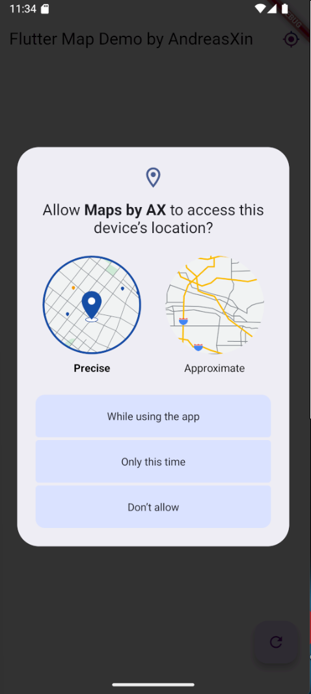
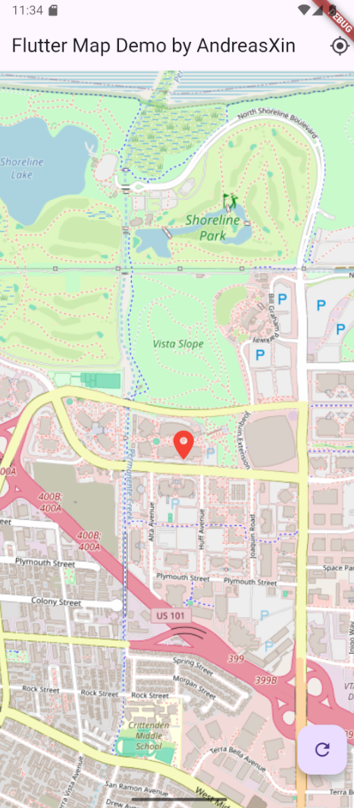

# 🗺️ Flutter Map with Location Access

[](https://flutter.dev)
[](https://dart.dev)
[](LICENSE)
[](https://github.com/ReyGaCuek/Flutter-Map)

A simple Flutter application demonstrating how to display a map and access the user's current location using [`flutter_map`](https://pub.dev/packages/flutter_map) and [`geolocator`](https://pub.dev/packages/geolocator`) packages.

---

## 🚀 Features

- Display interactive maps using OpenStreetMap
- Get and show current user location
- Request runtime location permissions (Android/iOS)
- Works on both Android and iOS

---

## 🧰 Minimum Requirements

### 💻 System Requirements

- **Operating System**:  
  Windows 10/11 (64-bit), macOS (latest), or Linux (64-bit)

- **Disk Space**:  
  At least 2 GB free (excluding IDE/tools)

- **Tools**:  
  Git (for version control)

---

### 🧪 Flutter SDK

- **Flutter**: `>=3.0.0`
- **Dart**: `>=2.17.0`

---

### 🛠️ Development Environment

To build and run this project successfully, ensure the following tools and dependencies are installed:

- Flutter SDK (recommended: latest stable version)

- Android Studio (for Android) or Xcode (for iOS)

- Android SDK (minimum API Level 21 - Android 5.0 Lollipop)

- Xcode (minimum version 13, supports iOS 11.0+)

- Android NDK version 27.0.12077973 or higher
(Required for native plugins compatibility and Flutter builds using JNI/native libs)

- Gradle version 8.0 or higher
(Ensure gradle-wrapper.properties is updated accordingly)

- Plugin dependencies such as permission_handler should use the latest compatible versions (e.g., ^11.0.0) to avoid deprecated API errors (PluginRegistry.Registrar)

To avoid build errors, also make sure:

- Your build.gradle.kts includes the correct ndkVersion

- minSdkVersion is set to 21 or above in defaultConfig

---

### 📱 Device Requirements

- **Android**:

  - Android 5.0+ device
  - Google Play Services enabled

- **iOS**:
  - iPhone 5s or newer
  - iOS 11.0 or later

---

### 📦 Dependencies

- [`flutter_map: ^5.0.0`](https://pub.dev/packages/flutter_map)
- [`latlong2: ^0.9.0`](https://pub.dev/packages/latlong2)
- [`geolocator: ^11.0.0`](https://pub.dev/packages/geolocator)
- [`permission_handler: ^10.4.0`](https://pub.dev/packages/permission_handler)

---

## 📄 License

MIT – see [LICENSE](LICENSE)

---

## 🖼️ Preview




---

## ⚙️ Getting Started

```bash
# 1. Clone the repo
git clone https://github.com/ReyGaCuek/Flutter-Map.git
cd map5app

# 2. Install dependencies
flutter pub get

# 3. Run the app
flutter run
```
